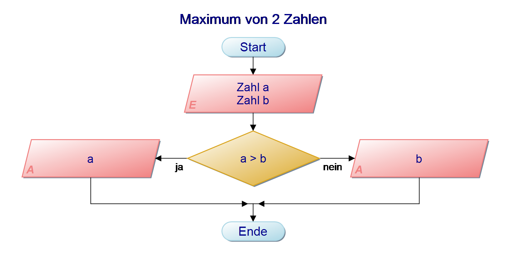
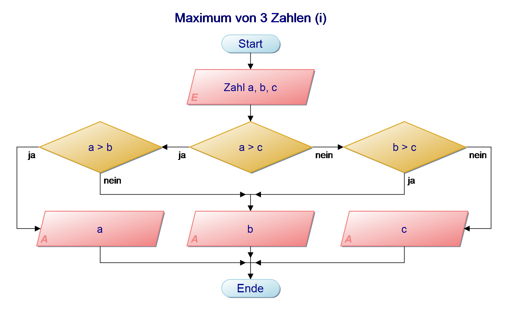
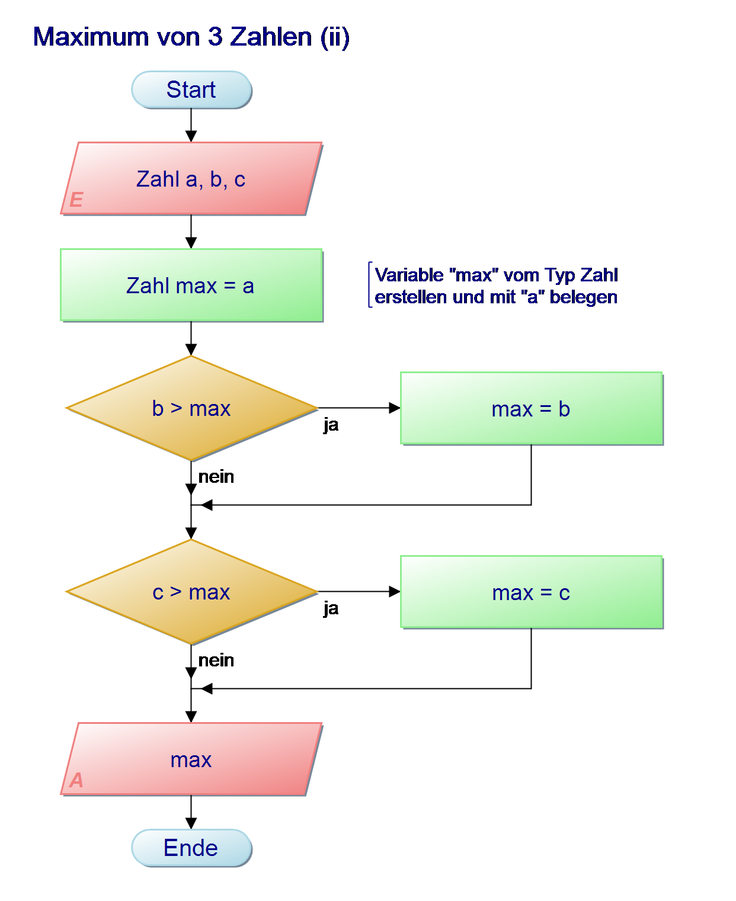
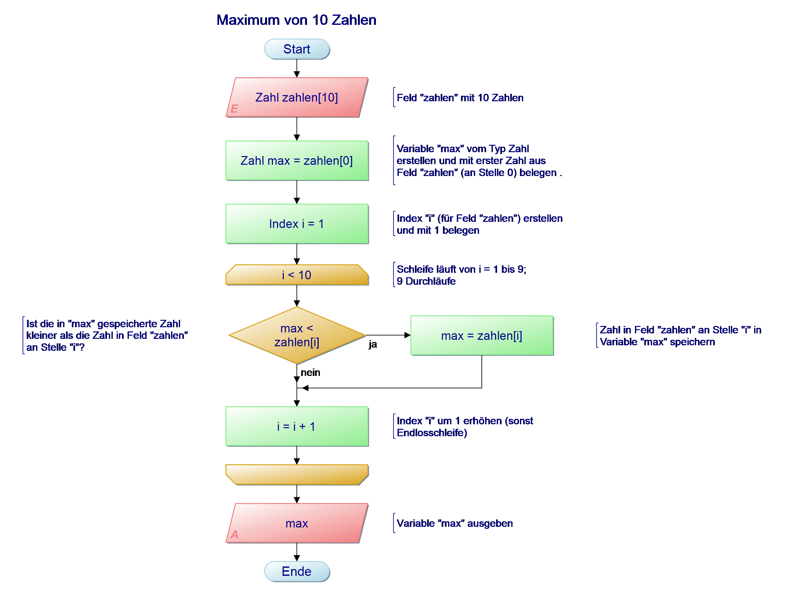
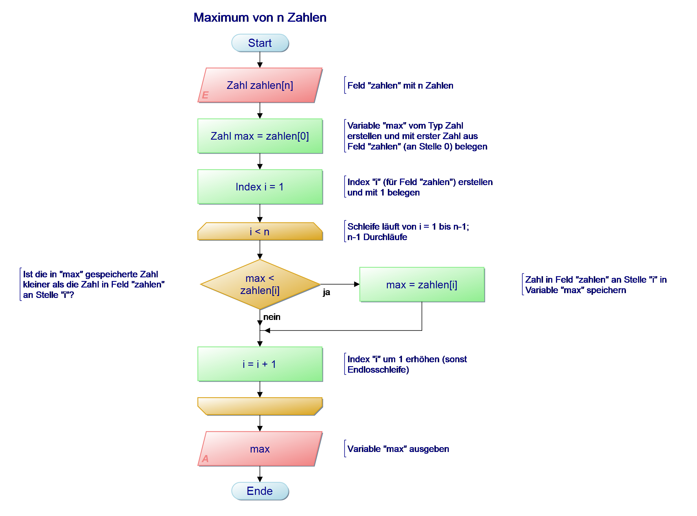
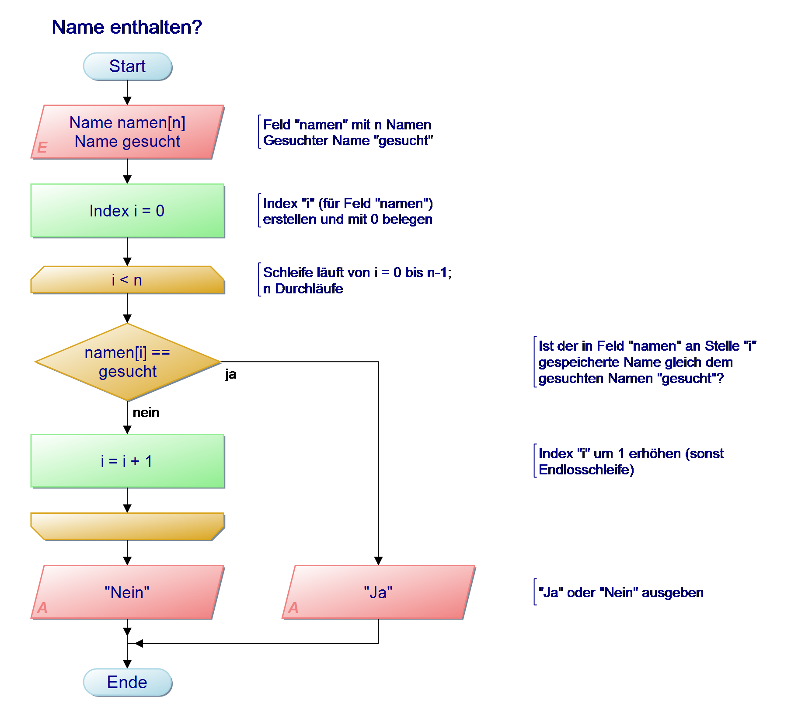

###### Methodik der Softwareentwicklung

# Programmablauf- pläne (flowcharts)

+++

### Abgrenzung

- Methodik der Softwareentwicklung
  - Algorithmen entwerfen
  - Fehler finden
- Algorithmen und Datenstrukturen
  - Algorithmen beurteilen (Speicherplatzbedarf, Geschwindigkeit, ...)
  - Alogrithmen verbessern
- C
  - Algorithmen implementieren

---

# Algorithmen

+++

### Definition

> Ein _Algorithmus_ ist eine _eindeutige Handlungsvorschrift_ zur Lösung eines Problems.

> Algorithmen bestehen aus _endlich vielen_, _wohldefinierten Einzelschritten_.
> Damit können sie zur Ausführung in einem Computer-programm implementiert, aber auch in menschlicher Sprache formuliert werden.
> Bei der Problemlösung wird eine bestimmte Eingabe in eine bestimmte Ausgabe überführt.

+++

### Eigenschaften

1. Endlichkeit (Finitheit)
2. Terminiertheit
3. Determiniertheit
4. Determinismus
5. Effizienz

+++

### Keine Unendlichkeit

- Endlichkeit (Finitheit), siehe auch [Komplexität](https://de.wikipedia.org/wiki/Komplexität_%28Informatik%29)
  - Statisch: Der Algorithmus hat endlich viele Schritte
  - Dynamisch: Der Algorithmus läuft mit endlich viel Prozessor- und Speicherkapazität

- Terminiertheit
  - Der Algorithmus endet für jede Eingabe

+++

### Deter... - was?!?

- [Determiniertheit](https://de.wikipedia.org/wiki/Determiniertheit_%28Algorithmus%29):
  - Bei gleicher Eingabe liefert der Algorithmus immer die gleiche Ausgabe

- [Determinismus](https://de.wikipedia.org/wiki/Determinismus_%28Algorithmus%29):
  - Bei gleicher Eingabe durchläuft der Algorithmus immer die gleiche Folge von Schritten
  - Deterministische Algorithmen sind immer auch determiniert

+++

### Und was noch?

- Effektivität:
  - Der Effekt jeden Schrittes ist eindeutig festgelegt

+++

### Wie findet man einen Algorithmus?

> Übung macht den Meister...

+++

### Übung


Formuliere Algorithmen in natürlicher Sprache

- Ein Bad nehmen
- Aufbackpizza backen
- Straße überqueren

---

# Programmablauf- pläne

+++

### Warum Algorithmen grafisch darstellen?

- "Ein Bild sagt mehr als tausend Worte"  
  Bilder sind intuitiv leichter erfassbar als Quellcode

- Programmablaufpläne sind daher gut geeignet zur
  - Übersicht
  - Dokumentation
  - Kommunikation

+++

### Definition

> Ein _Programmablaufplan_ (PAP) ist ein Ablaufdiagramm für ein Computerprogramm, das auch als Flussdiagramm (engl. flowchart) oder Programmstrukturplan bezeichnet wird.  
> Es ist eine graphische Darstellung zur Umsetzung eines Algorithmus in einem Programm und beschreibt die Folge von Operationen zur Lösung einer Aufgabe.

+++

### Eigenschaften

- Leicht lesbar

- Zeigen die Struktur des Programms

- Verwenden wenige grafische Symbole für verschiedene Vorgänge

- Genormt in DIN 66001

+++?image=assets/images/papdef-startende.png&size=40%

### Start / Ende

- Kommen jeweils genau einmal vor

- Name nicht vergessen

+++?image=assets/images/papdef-eingabeausgabe.png&size=40%

### Eingaben / Ausgaben

- Können mehrfach vorkommen

- Eingaben typischerweise per Tastatur

- Ausgaben typischerweise per Monitor

- Wichtig: Eingaben einen Namen zuweisen

  - Braucht ihr in Operationen
  - Gut: "Zahlen `a`, `b` und `c`"

  - Schlecht: "3 Zahlen"

+++?image=assets/images/papdef-operation.png&size=40%

### Operationen

- Zentrale Elemente im PAP

- Je ein Eingangs- und ein Ausgangspfeil

- Exakt definiert. Möglicher Inhalt:

  1. Variablendeklaration (Bsp: `int i`)
  2. Wertzuweisung (Bsp: `i = 3`)
  3. Beides gleichzeitig (Bsp: `int i = 3`)

+++?image=assets/images/papdef-kommentar.png&size=49%

### Kommentare

- Enthalten Zusatzinformation

- Tragen zum besseren Verständnis des Programms bei

- Erklären schwierige Sachverhalte

- Helfen bei der (Wieder-) Einarbeitung

- Können ToDos für die Weiterentwicklung enthalten

+++?image=assets/images/papdef-abfrage.png&size=40%

### Abfragen

- Ermöglichen unterschiedliche Reaktion auf Eingaben

- Verzweigen den Programmfluss nach dem Wenn-Dann-Prinzip

- Enthaltene Ausdrücke müssen auf Ja (`true`, `1`) oder Nein (`false`, `0`) auswerten

- Bsp: `i == 10` oder `x < 5`

+++?image=assets/images/papdef-schleife.png&size=40%

### Schleifen

- Abbruchbedingung entweder im Kopf oder im Fuß
- Symbol ersetzt Abfrage mit Abbruchbedingung
- Kopfgesteuert: erst Abbruchbedingung testen
- Fußgesteuert: erst Schleifeninhalt ausführen

+++?image=assets/images/papdef-unterprogramm.png&size=40%

### Unterprogramme

- Sinnvoll wenn gleiche Programmteile mehrfach vorkommen
- Verringern die Redundanz (DRY)
- Erhöhen die Übersicht
- Werden so entworfen als stünde der Inhalt direkt im PAP
- Ggf: Parameter in Kommentar definieren

+++

### Übung 1

Erstelle einen Programmablaufplan, der das Maximum zweier natürlicher Zahlen `a` und `b` ausgibt.

+++

### Übung 1 - Lösung



+++

### Variablen

Variablen sind **Platzhalter** für einen Wert.

C schafft diesen Platz (im RAM) bei der **Variablendeklaration**. Damit C den Wert der Variable korrekt interpretieren kann, müsst ihr zusätzlich einen **Datentyp** angegeben.

Syntax: `Datentyp Variablenname`

+++


### Beispiele Variablendeklaration

`int i1` `float pi` `char erster_buchstabe` `Zahl maximum` `Index i2` `Name vorname`


Danach könnt ihr die Variable verwenden:

Bsp. in Operation: `maximum = 3`

Bsp. in Abfragen: `i1 > 0` `vorname == „Thomas“`

+++

### Beispiele Datentyp

- C: `short`, `int`, `float`, `double`, `char`
- PAP: `Zahl`, `Index`, `Name`, `Wort`, `Satz`, `Zeichenkette`
- Kommentare zur Variablendeklaration schaden nicht...

+++

### Beispiele Variablenname

- `i1`, `pi`, `erster_buchstabe`, `maximum`, `vorname`
- Alphanumerisch
- Klein geschrieben
- Keine Leerzeichen (besser: Unterstrich `_` oder Bindestrich `-`)

+++

### Wertzuweisung I

Nach der Deklaration haben Variablen noch keinen bestimmten Wert. Dieser muss ihnen erst zugewiesen werden.

Syntax: `Variablenname = Wert`

Bsp:  `maximum = 3`,  `vorname = „Stefan“`

Einer Variable können beliebig oft (neue) Werte zugewiesen werden


+++

### Wertzuweisung II

Der Wert einer Variable kann einer anderen Variable zugewiesen werden.

Bsp: `maximum = z`

Hier wird der Wert von `z` der Variable `maximum` zugewiesen. D.h. `maximum` wird mit dem Wert von `z` überschrieben. Danach haben beiden Variablen den Wert von `z`.

Wichtig: Es ändert sich _immer_ der Wert der _linken_ Variable, _nie_ der Wert der _rechten_ Variable!

+++

### Ausdrücke I

Einer Variable kann ein Wert durch die **Auswertung** eines **Ausdrucks** zugewiesen werden.

Bsp:  `z = 5 + 7 - 3`

Der Ausdruck `5 + 7 - 3` wird ausgewertet und ergibt den Wert `9`. Dieser wird dann der Variable `z` zugewiesen.

+++

### Ausdrücke II

Ausdrücke können Variablen beinhalten. Bsp:

`maximum = z + 5`

`maximum = (3 * z * z) + (5 * z) - 12`

Eine Variable kann auch selbst in dem Ausdruck enthalten sein, der ihr zugewiesen wird:

Bsp: `z = z + 1`

Hier wird der Wert von `z` erst um `1` erhöht und dann `z` zugewiesen.

+++

### Ausdrücke III

**Boolsche Ausdrücke** sind Ausdrücke die entweder Ja (`true`, `1`) oder Nein (`false`, `0`) ergeben. Bsp:

`i1 == 3`, `maximum < a`, `stop_loop != true`

Abfragen repräsentieren Entscheidungen und _müssen_ boolsche Ausdrücke enthalten.

+++

### Übung 2

Erstelle einen Programmablaufplan, der das Maximum dreier natürlicher Zahlen `a`, `b` und `c` ausgibt.

+++

### Übung 2 - Lösung ohne Zwischenspeicher



+++

### Übung 2 - Lösung mit Zwischenspeicher



+++

### Felder (arrays)

Ein Feld ist eine Variable die mehrere Werte speichern kann.

Die Länge des Felds bestimmt die Anzahl der Werte. In C müssen bei der Deklaration Datentyp und Länge angegeben werden:

Syntax: `Datentyp Feldname[Länge]`

+++

### Beispiele Felddeklaration

Bsp: `int eingabewerte[5]`, `Name a[3]`

Das Feld `a` kann drei Werte speichern. Diese werden mit `a[0]`, `a[1]` und `a[2]` angesprochen. Die Zahl in der Klammer wird Index genannt.

Wichtig:
- Der erste Wert hat den Index `0` (nicht `1` !)
- Das letzte Wert eines Felds der Länge `n` hat den Index `n-1` (nicht `n` !)

+++

### Felder - Wertzuweisung

Wie bei Variablen, können Feldern mit `=` Werte zugewiesen werden.

Syntax: `Feldname[Index] = Wert`

Bsp: `a[0] = 253`, `a[1] = 254` etc.

Der Index kann auch eine Variable sein. Bsp:

```
int i = 0
a[i] = 25
```

+++

### Felder und Schleifen

Verwendet man für den Index eines Feldes eine Variable, die in einer Schleife alle Index-Werte durchläuft (z.B. von `0` bis `n-1`), so kann die Handhabung der im Feld gespeicherten Werte automatisiert werden. Bsp:

```
PAP einfügen
```

+++

### Übung 3

Erstelle einen Programmablaufplan, der das Maximum von 10 natürlichen Zahlen ausgibt.

Übergeben wird ein Feld vom Typ Zahl der Länge 10

+++

### Übung 3 - Lösung



+++

### Übung 4

Erstelle einen Programmablaufplan, der das Maximum von n natürlichen Zahlen ausgibt.

Übergeben wird ein Feld vom Typ Zahl der Länge n

+++

### Übung 4 - Lösung



+++

### Übung 5

Erstelle einen Programmablaufplan, der ausgibt, ob ein bestimmter Name in einem Feld enthalten ist.



Übergeben wird ein Feld mit `n` Namen, sowie der gesuchte Name.

+++

### Übung 5 - Lösung



+++

### Übung 6

Erstelle einen Programmablaufplan, der ausgibt, an welcher Position ein bestimmter Name erstmals in einem Feld vorkommt.



Übergeben wird ein Feld mit `n` Namen, sowie der gesuchte Name.

+++

### Übung 7

Erstelle einen Programmablaufplan, der ausgibt, wie oft ein bestimmter Name in einem Feld enthalten ist.



Übergeben wird ein Feld mit `n` Namen, sowie der gesuchte Name.

+++

### Qualität

+++

new commit in nested-branch-test branch

new commit on local master

new commit on local master
